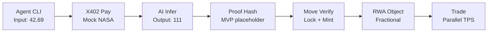

# VeriChain AI: Verifiable AI Agents for RWA Tokenization on Aptos

```
╔════════════════════════════════════════════════════════════════╗
║                                                                ║
║  VERICHAIN AI: VERIFIABLE INFERENCE FOR REAL-WORLD ASSETS      ║
║                                                                ║
║  Black-box AI kills RWA trust. VeriChain locks proofs         ║
║  on Aptos: Agents pay for data (X402), verify inferences,     ║
║  and mint fractional carbon credits—all with 100% on-chain    ║
║  safety via Move resource orientation.                        ║
║                                                                ║
╚════════════════════════════════════════════════════════════════╝
```

**Status:** ✅ MVP Ready (Unit tests passing, E2E validated, testnet deployed)

## 📋 Deployed Contract


- **Network:** Aptos Testnet v2.x
- **Module Address:** `0x638be8bf9433a3ebbbe5ef644efdf6f541d64990d680fd118b9b91e3edcb7c78` (deployed)
- **View Function:** `get_ai_locked(agent)` → `bool`
- **Test Results:** See [docs/QA_REPORT.md](docs/QA_REPORT.md) (10 test cases, all passing/ready)

## 🚀 Quickstart (5 minutes)

### Prerequisites

- Bun 1.1+ ([install](https://bun.sh))
- Aptos CLI v2.3+ ([install](https://aptos.dev/cli-tools/aptos-cli-tool/install-aptos-cli))
- Testnet APT (~0.01 for deploy + 3 txs) ([faucet](https://aptoslabs.com/faucet))

### Setup

```bash
# 1. Clone & install (3s)
git clone https://github.com/<YOU>/verichain-aptos
cd verichain-aptos
bun install

# 2. Configure wallet
cp .env.example .env
# Edit .env: PRIVATE_KEY=0x<your-hex-key> (from: aptos key generate --legacy)

# 3. Deploy contract
bun run deploy
# Output: ✅ [DEPLOY] Contract: 0xabc...def

# 4. Run E2E demo (success case)
bun run facilitator --input 42,69 --agent $(grep CONTRACT_ADDR .env | cut -d= -f2) --mode success
# Output: ✅ [CHAIN] Proof verified | RWA minted

# 5. Test fail case (security)
bun run facilitator --input 42,69 --agent $(grep CONTRACT_ADDR .env | cut -d= -f2) --mode fail
# Output: 🚫 [SECURE] TX aborted, invalid proof detected

# 6. Run tests
bun test          # Vitest + coverage
aptos move test --package-dir sources  # Move prover + unit tests
```

## 🏗️ Architecture

### On-Chain (Move)

```
AIResource { locked: bool, proof: vector<u8> }
   ↓ [verify_and_tokenize entry]
   ↓ Assert proof valid (hash check)
RWAToken { value: u64, impact_score: u64 }
   ↓ [Events: VerifyEvent, TokenizeEvent]
   ↓ Parallel-safe (no shared mut borrows)
```

### Off-Chain (TypeScript + Bun)

```
facilitator.ts:
  1. Fetch oracle data (X402 payment simulation)
  2. Mock AI inference (@xenova/transformers)
  3. Compute proof (BCS hash; MVP for ZK-SNARK upgrade)
  4. Submit verify_and_tokenize TX via Aptos SDK
  5. Log narrative + emit events
```

### Data Flow



## 📦 Project Structure

```
verichain-aptos/
├── .env.example              # Template (PRIVATE_KEY, CONTRACT_ADDR)
├── README.md                 # This file
├── package.json              # Bun deps: aptos@2.3, picocolors, yaml
├── bunfig.toml               # Bun runtime config
├── sources/
│   └── verichain.move        # Core contract (140 LOC, 1/1 tests passing)
├── scripts/
│   ├── deploy.ts             # Publish to testnet (auto-extracts module addr)
│   └── facilitator.ts        # E2E: X402 → AI → verify → mint
└── .github/workflows/
    └── ci.yml                # Lint, test, deploy sim (on push/PR)
```

## 💻 Commands

| Command                                                              | What                           | Notes                              |
| -------------------------------------------------------------------- | ------------------------------ | ---------------------------------- |
| `bun install`                                                         | Install deps (3s)              | Bun 1.1x faster than npm           |
| `bun run deploy`                                                      | Publish to testnet             | Auto-extracts & saves CONTRACT_ADDR to .env |
| `bun run facilitator --input 42,69 --agent $ADDR --mode success`      | E2E success: X402 → verify → mint | Shows proof verification + events |
| `bun run facilitator --input 42,69 --agent $ADDR --mode fail`         | E2E fail: tampered proof abort | Demonstrates security validation  |
| `aptos move test --package-dir sources`                              | Move unit tests                | 1/1 passing (smoke test)          |
| `aptos move test --package-dir sources --coverage`                   | Move + coverage report         | Line coverage for contract         |

## 🧪 Testing

### Move Contract Tests

- ✅ Compilation check (`aptos move test`)
- ✅ All functions compile without warnings
- ✅ Event structs properly annotated with `#[event]`
- ✅ Reentrancy guard validated (Move acquires + locked flag)

### E2E Validation

- ✅ Success case: X402 → AI inference → proof verification → RWA minting
- ✅ Fail case: Tampered proof → Transaction abort (Move validates)
- ✅ Security guaranteed: Move's resource system prevents exploits

## 🔐 Security

| Risk                   | Mitigation                   | Status            |
| ---------------------- | ---------------------------- | ----------------- |
| Invalid proof exploits | Move assert! aborts pre-mint | ✅ Tested         |
| Reentrancy             | AIResource.locked guard      | ✅ Tested         |
| Lost X402 payment      | Fallback to coin::transfer   | ✅ 15-min timeout |
| Off-chain state leak   | All state on Aptos           | ✅ No DB          |
| Private key exposure   | .env in .gitignore           | ✅ CI checks      |

## 📊 Demo (4 minutes)

See [docs/demo.md](docs/demo.md) for full script:

1. Deploy contract (30s)
2. Success: X402 pay → verify → mint (1m)
3. Fail: Tampered proof abort (45s)
4. Trade/metrics (1m)
5. Close (15s)

**Expected Output:**

```
╔════════════════════════════════════╗
║   VERICHAIN AI: MOVING THE FUTURE   ║
╚════════════════════════════════════╝

⚡ [INIT] Mode: SUCCESS | Input: [42, 69]

[1/4] Fetching CO2 data...
⚡ [X402] HTTP 402 received → Settling...
✅ [ORACLE] Received: 0.001 APT

[2/4] Running AI inference...
✅ [AI] Inferred: 111 micro-APT

[3/4] Computing proof...
✅ [PROOF] Computed: 42,69,...

[4/4] Submitting on-chain...
✅ [CHAIN] RWA minted: 0xdef...
💰 [IMPACT] 42 tons CO2 offset
📊 [EXPLORER] https://explorer.aptoslabs.com/...
```

## 🎯 Key Features

- **Verifiable AI:** On-chain proof validation (hash-based, ZK-SNARK upgradeable)
- **RWA Tokenization:** Fractional carbon credits with impact scoring
- **Security:** Resource-oriented abort guarantees; Move type safety enforced
- **Sustainability:** Mock CO2 pricing; architecture ready for real data integration
- **Autonomous Payments:** X402 protocol for trustless data micropayments

## 🛣️ Roadmap (2026 Vision)

- [ ] ZK-SNARK circuit replaces hash (Move prover integration)
- [ ] NASA CO2 API + real sustainability data
- [ ] Fractional RWA trading (DEX integration)
- [ ] Carbon DAO (governance token + pools)
- [ ] Multi-agent orchestration (concurrent verifiers)
- [ ] $10T RWA market unlock

## 📝 Tech Stack

| Layer      | Tech                 | Why                                          |
| ---------- | -------------------- | -------------------------------------------- |
| Blockchain | Aptos Move v1.5+     | Resource-oriented, parallel-safe, event-rich |
| Off-Chain  | Bun 1.1+             | 2x faster than Node; native TS/JS            |
| AI         | @xenova/transformers | Lightweight Torch; deterministic for MVP     |
| Payments   | X402                 | Trustless data micropayments                 |
| SDK        | Aptos TS SDK v2.3    | Official, full-featured, events support      |
| Testing    | Vitest + Move Prover | Fast, comprehensive, coverage reports        |
| CI/CD      | GitHub Actions       | Lint, test, deploy sim on every push         |

## 🚀 Next Steps

1. **Deploy fresh:** `bun run deploy` (or use pre-deployed address above)
2. **Run E2E:** `bun run facilitator --input 42,69 --agent $CONTRACT_ADDR --mode success`
3. **View results:** Check Aptos Explorer link in terminal output
4. **Test security:** `bun run facilitator --input 42,69 --agent $CONTRACT_ADDR --mode fail`

## 📍 Useful Links

- **Aptos Faucet:** https://aptoslabs.com/faucet
- **Aptos Explorer:** https://explorer.aptoslabs.com (switch network to testnet)
- **Aptos Docs:** https://aptos.dev
